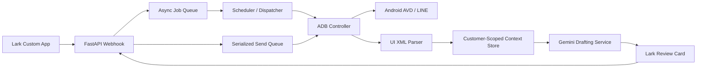

# Project Echo Technical Feasibility Report

## Executive Summary

Project Echo is technically feasible on a Mac mini M4 using Android Studio AVD, ADB automation, FastAPI, Lark Custom App webhooks, and an external LLM provider such as Gemini. The highest-risk areas are not raw implementation difficulty, but operational stability, account safety, emulator scaling, and compliance with platform limitations.

The recommended first milestone is a narrow human-in-the-loop workflow: receive a Lark command, read recent LINE OpenChat messages from one emulator through `uiautomator`, generate a draft, send the draft back to Lark for approval, and only then execute a controlled ADB send action.

## Feasibility By Module

### 1. Lark / API Module

Status: Feasible

Core requirements:

- FastAPI can receive Lark event callbacks and support `url_verification`.
- Lark interactive cards can support approval actions such as send, edit, and ignore.
- Webhook requests should return within 3 seconds.
- Long-running work should be pushed into an async worker queue.

Recommended approach:

- `POST /webhooks/lark/events` handles Lark events.
- Validate request signature and timestamp before processing.
- Immediately acknowledge valid events.
- Push AI generation, emulator reads, and ADB actions to a background queue.
- Use Lark proactive messaging APIs to send results after processing.

Primary risks:

- Lark callback retries may duplicate jobs if idempotency is missing.
- Interactive card actions need strict permission checks.
- Exposing the local Mac through a tunnel requires careful secret handling.

Mitigations:

- Store processed Lark event IDs.
- Require operator allowlists for send actions.
- Keep app secrets in `.env`, never in source files.
- Prefer Cloudflare Tunnel with access control over public unauthenticated URLs.

### 2. ADB / RPA Module

Status: Feasible with operational constraints

Core requirements:

- `adb shell uiautomator dump` can extract UI hierarchy XML.
- XML parsing can identify visible chat text.
- `adb shell input tap`, `adb shell input text`, and key events can simulate user actions.
- Multiple emulator instances can be addressed by ADB serial ID.

Recommended approach:

- Treat every emulator as a registered device with a stable `device_id`.
- Maintain per-device state: current account, assigned communities, active customer, last read timestamp.
- Use UI text and resource IDs where available instead of absolute coordinates.
- Fall back to calibrated coordinates only for stable controls.

Primary risks:

- LINE UI changes may break selectors.
- Android emulator performance may degrade with many concurrent instances.
- Non-Latin text input through `adb shell input text` can be unreliable.
- Popups, updates, login prompts, and permission dialogs can interrupt automation.

Mitigations:

- Implement `check_current_app()` before every critical action.
- Keep screenshot and XML snapshots for failed runs.
- Use clipboard paste or IME-based text injection for Chinese/Japanese text if plain ADB text input fails.
- Limit active concurrent emulators to 3-4 and schedule the rest.
- Build a recovery flow: Home -> launch LINE -> navigate to target chat -> verify title.

### 3. AI / LLM Module

Status: Feasible

Core requirements:

- Read recent 10-20 chat messages.
- Load matching persona file, such as `Soul.md`.
- Generate structured decisions and draft replies.
- Distinguish cold room, user question, active conversation, and no-action cases.

Recommended approach:

- Use strict JSON output from the LLM.
- Separate analysis from drafting.
- Keep persona, customer rules, and community rules as explicit context blocks.
- Record every prompt and model response in customer-scoped logs.

Suggested decision schema:

```json
{
  "action": "draft_reply",
  "reason": "user_question",
  "confidence": 0.82,
  "draft": "我覺得可以先看你目前預算和需求...",
  "risk_flags": [],
  "should_send": false
}
```

Primary risks:

- Persona leakage between customers.
- Hallucinated advice, especially in finance, health, legal, or parenting contexts.
- Over-posting can increase platform risk.

Mitigations:

- Enforce customer-scoped context loading.
- Add category-specific safety rules.
- Keep `should_send` false by default and require Lark approval.
- Add rate limits per account, community, and customer.

## LINE OpenChat Constraints

LINE OpenChat does not provide a general official automation API for this use case. The system must therefore rely on UI automation. This is possible, but inherently more fragile than API-based integration.

Important implications:

- UI selectors can change after app updates.
- Account state must be monitored continuously.
- Sending behavior must look human-paced.
- Full unattended operation is higher risk than human-reviewed operation.

Recommended posture:

- Phase 1 and Phase 2 should be human-in-the-loop only.
- Autonomous sending should not be enabled until account safety data is collected.
- Add a global kill switch before scaling beyond one or two accounts.

## Mac Mini M4 Capacity Assessment

The Mac mini M4 should comfortably run the API service, background workers, local storage, and a small number of Android ARM64 emulators. The practical constraint is emulator count, not Python service load.

Recommended operating assumptions:

- Active emulators: 3-4 concurrent instances.
- Managed communities: 20-40 through scheduled rotation.
- Polling interval: 1-2 hours per community.
- AI generation: remote Gemini API, not local model inference for production decisions.

Capacity risks:

- Emulator RAM and GPU pressure.
- ADB instability when too many devices are active.
- LINE account session conflicts.

Mitigations:

- Stagger emulator activity.
- Keep only the needed instances running.
- Use a scheduler that locks each device while a task is running.
- Collect CPU, memory, ADB latency, and emulator health metrics.

## Security And Privacy Feasibility

Status: Feasible if designed from the start

Required controls:

- Customer-level directory isolation.
- Encrypted secrets via environment variables or local secret manager.
- Access-controlled Lark commands.
- Audit log for every generated draft and every send action.
- No cross-customer prompt assembly.

Recommended directory policy:

- Raw XML, cleaned messages, prompts, model outputs, and send logs must all live under a single customer root.
- Shared templates may be global.
- Customer data may never be loaded by global prompt builders without an explicit customer ID.

## Anti-Spam And Account Safety

Status: Technically feasible, operationally sensitive

Minimum implementation requirements:

- Random delay before send: `random.uniform(5, 30)`.
- Human-like typing or segmented paste flow.
- Quiet hours outside configured activity windows, default `09:00-23:00`.
- Per-account and per-community send caps.
- No simultaneous posting from multiple accounts on the same fixed IP.

Recommended guardrails:

- Global send queue that serializes posts under fixed-IP mode.
- Account cooldown after every send.
- Community cooldown after every send.
- Manual approval required for all Phase 1 and Phase 2 sends.
- Emergency pause switch in Lark.

## Proposed Architecture



## Recommended Implementation Phases

### Phase 0: Local Probe

Goal:

- Verify ADB can detect emulator.
- Verify LINE can be opened.
- Verify `uiautomator dump` returns useful chat text.

Exit criteria:

- One command can collect XML from a target device.
- Parser can extract visible messages into structured JSON.

### Phase 1: Lark To Emulator Send

Goal:

- Send text from Lark to one emulator.

Exit criteria:

- Lark command creates a job.
- Mac executes ADB input sequence.
- Lark receives success or failure result.

### Phase 2: Chat Readback

Goal:

- Pull recent 10 messages from one OpenChat and return them to Lark.

Exit criteria:

- XML is cleaned.
- Chat lines are parsed.
- System nodes such as time, battery, navigation labels are filtered.

### Phase 3: AI Draft With HIL

Goal:

- Generate persona-aware drafts and send approval cards.

Exit criteria:

- Drafts include reason and confidence.
- Operator can approve, edit, or ignore.
- Approved sends are audited.

### Phase 4: Multi-Community Patrol

Goal:

- Rotate through 10 communities across 3-4 emulators.

Exit criteria:

- Scheduler avoids simultaneous posting.
- Per-customer data isolation is verified.
- Seven-day stability run completes without account anomalies.

## Go / No-Go Assessment

Go for prototype:

- ADB UI extraction is practical.
- Lark integration is straightforward.
- Human-in-the-loop drafting lowers risk.

Conditional for production:

- Requires robust recovery flows.
- Requires strong rate limits and audit logs.
- Requires customer isolation tests.
- Requires operational runbooks for account lock, emulator crash, LINE update, and tunnel failure.

No-go areas for early versions:

- Fully autonomous 24-hour sending.
- Running all accounts concurrently under one fixed IP.
- Cross-customer shared context.
- Blind coordinate-only automation without UI verification.

## Final Recommendation

Proceed with a phased prototype. Start with one emulator, one account, one customer folder, and one Lark approval flow. Do not scale to 10 communities until XML parsing, app recovery, audit logging, and serialized send controls are proven.
